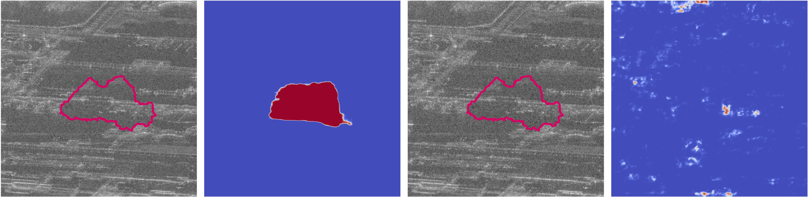

# Hiding Local Manipulations on SAR Images: a Counter-Forensic Attack

[**Hiding Local Manipulations on SAR Images: a Counter-Forensic Attack**](https://arxiv.org/pdf/2407.10736), currently under review.

Sara Mandelli, Edoardo Daniele Cannas, Paolo Bestagini, Stefano Tebaldini Stefano Tubaro<br/>
[Image and Sound Processing Lab - Politecnico di Milano](http://ispl.deib.polimi.it/)


_The vast accessibility of SAR images through online portals has propelled the research across various fields. This widespread use and easy availability have unfortunately made SAR data susceptible to malicious alterations, such as local editing applied to the images for inserting or covering the presence of sensitive targets. 
To contrast malicious manipulations, in the last years the forensic community has begun to dig into the SAR manipulation issue, proposing detectors that effectively localize the tampering traces in amplitude images. Nonetheless, in this paper we demonstrate that an expert practitioner can exploit the complex nature of \gls{sar} data to obscure any signs of manipulation within a locally altered amplitude image. We refer to this approach as a counter-forensic attack.
To achieve the concealment of manipulation traces, the attacker can simulate a re-acquisition of the manipulated scene by the SAR system that initially generated the pristine image.
In doing so, the attacker can obscure any evidence of manipulation, making it appear as if the image was legitimately produced by the system. This attack has unique features that make it both highly generalizable and relatively easy to apply. First, it is a black-box attack, meaning it is not designed to deceive a specific forensic detector. Furthermore, it does not require a training phase and is not based on adversarial operations. We assess the effectiveness of the proposed counter-forensic approach across diverse scenarios, examining various manipulation operations. The obtained results indicate that our devised attack successfully eliminates traces of manipulation, deceiving even the most advanced forensic detectors._ 
<p align="center">

</p>

## Code
Coming soon

## How to cite

```bibtex
@article{mandelli2025hiding,
  title={Hiding Local Manipulations on SAR Images: a Counter-Forensic Attack},
  author={Mandelli, Sara and Cannas, Edoardo Daniele and Bestagini, Paolo and Tebaldini, Stefano and Tubaro, Stefano},
  journal={arXiv preprint arXiv:2407.07041},
  year={2024}
}
```
